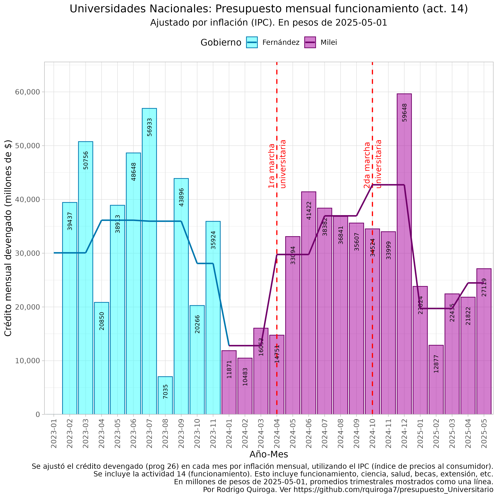
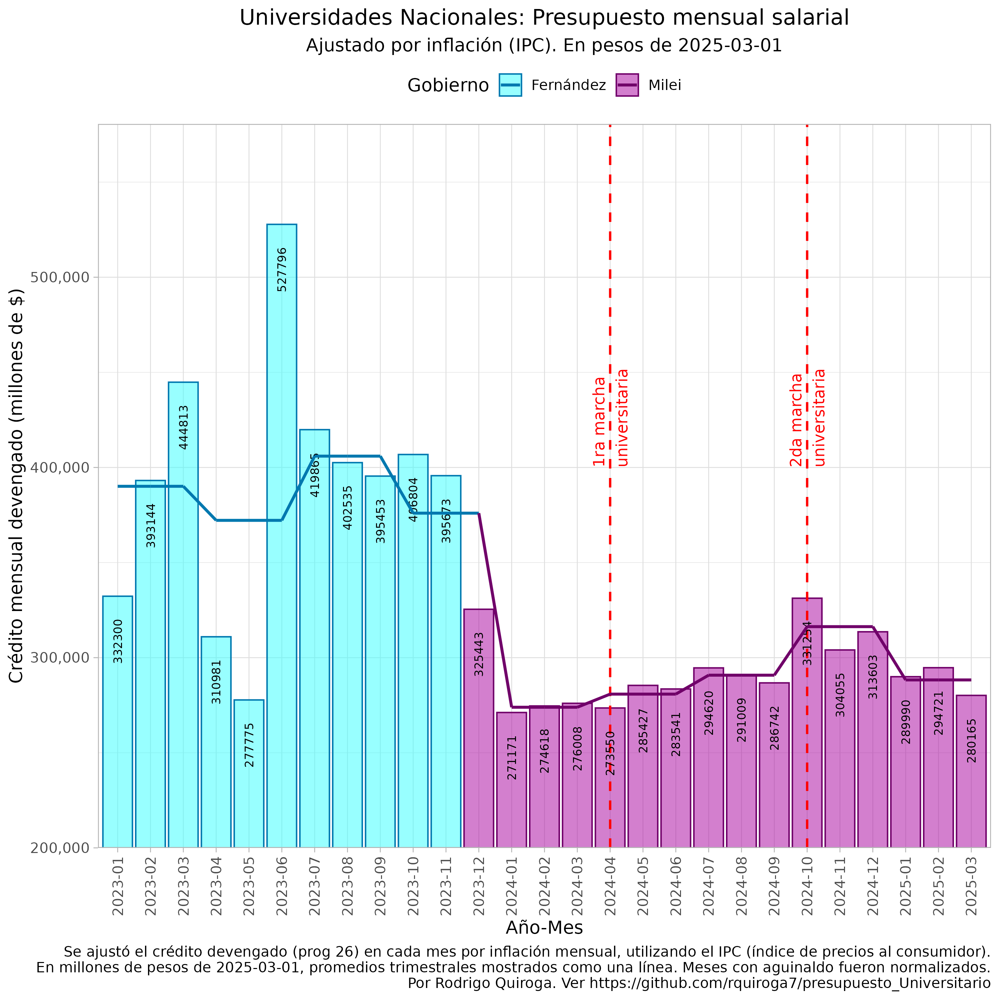
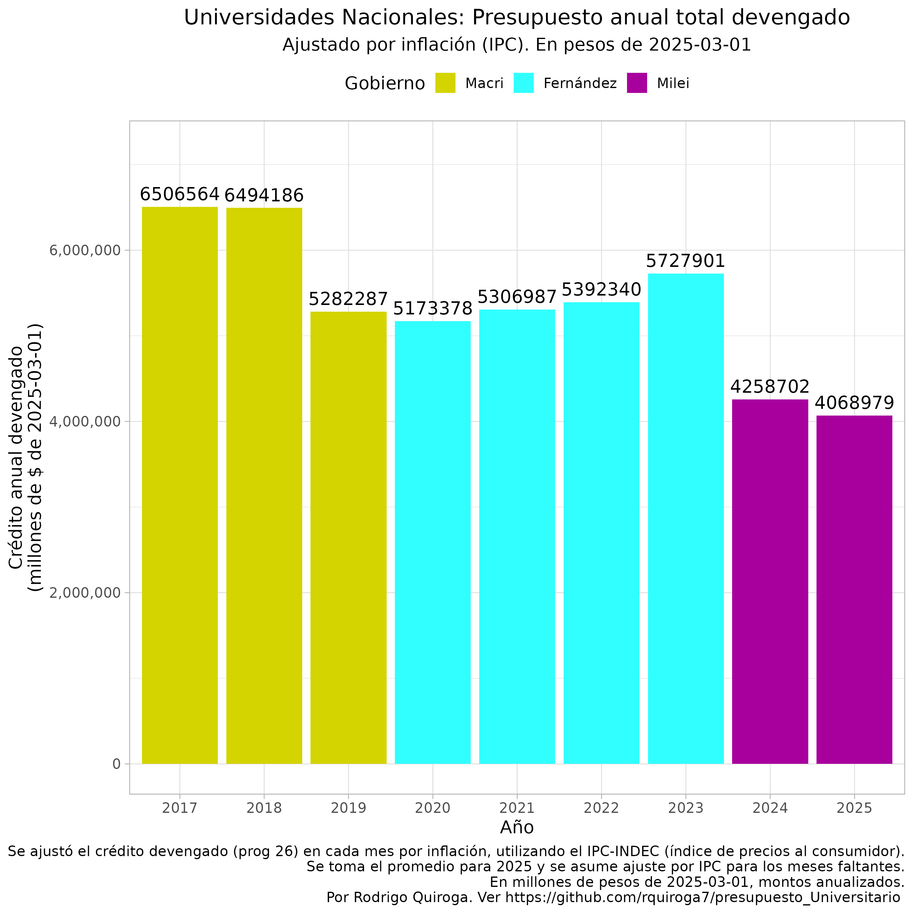
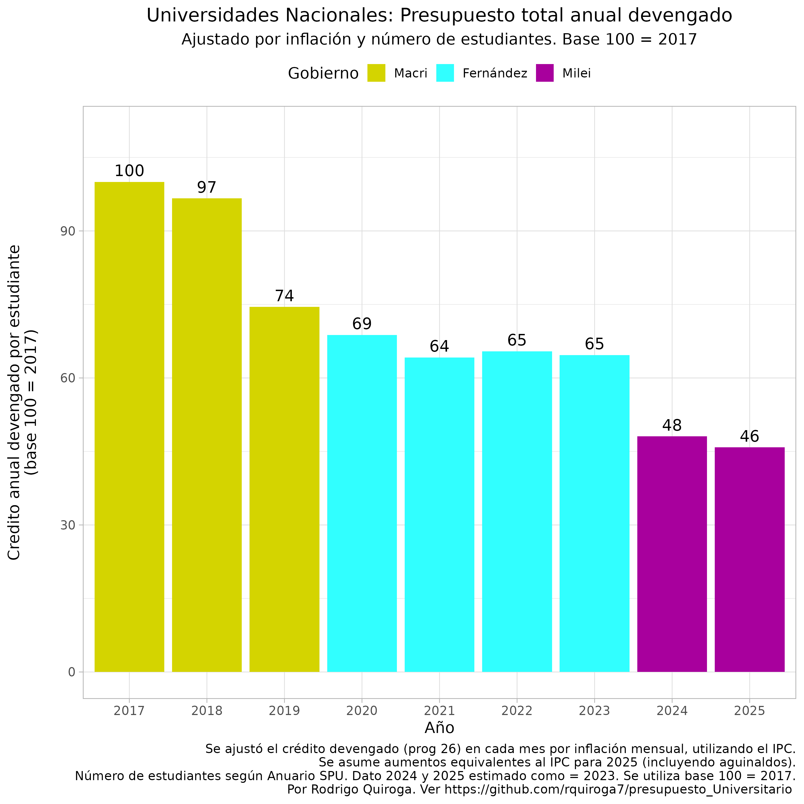
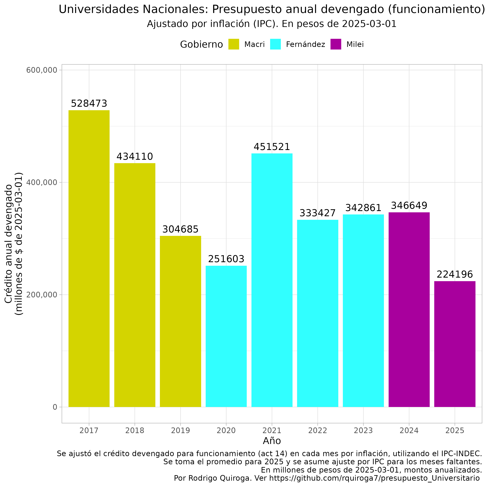
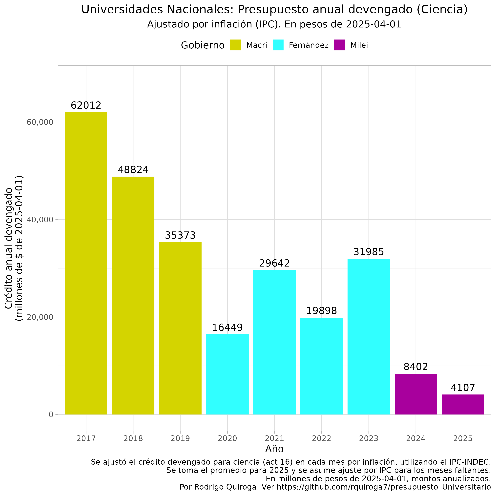
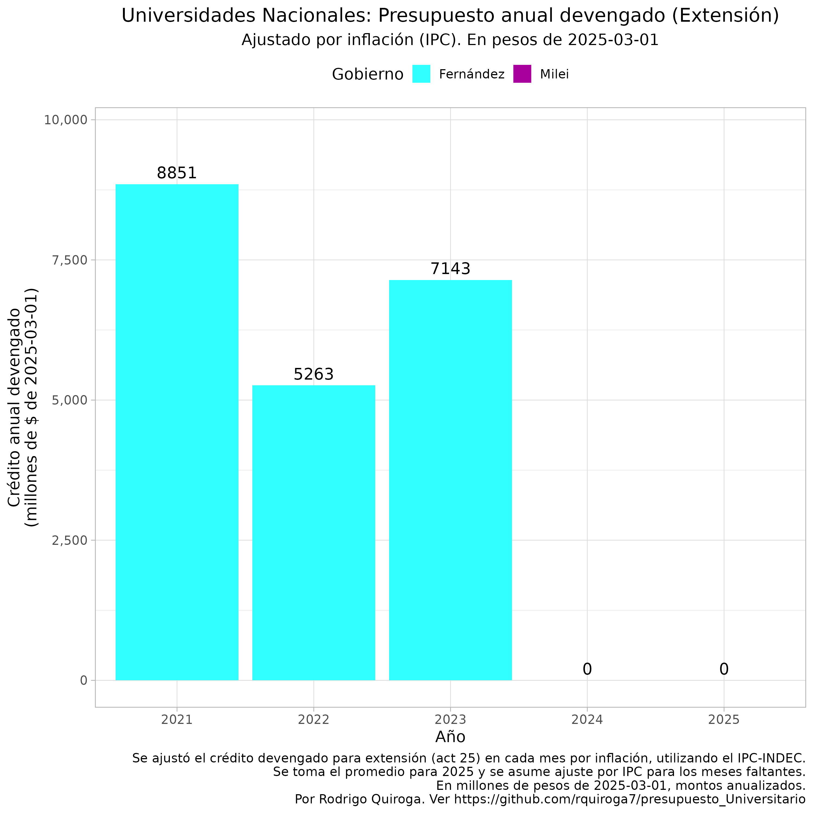
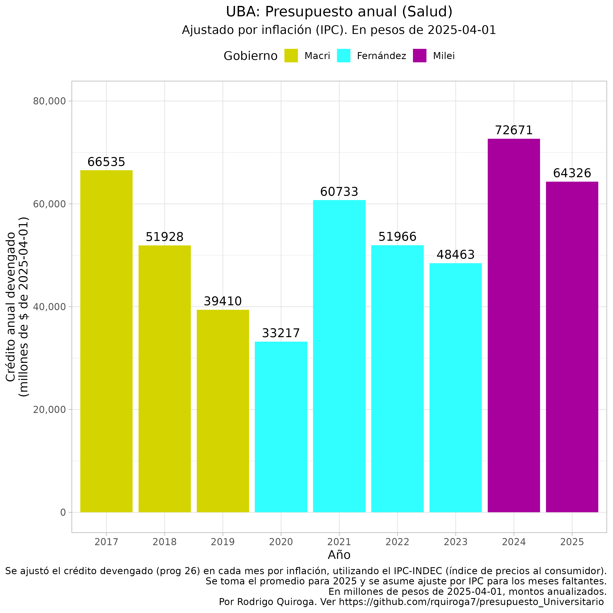
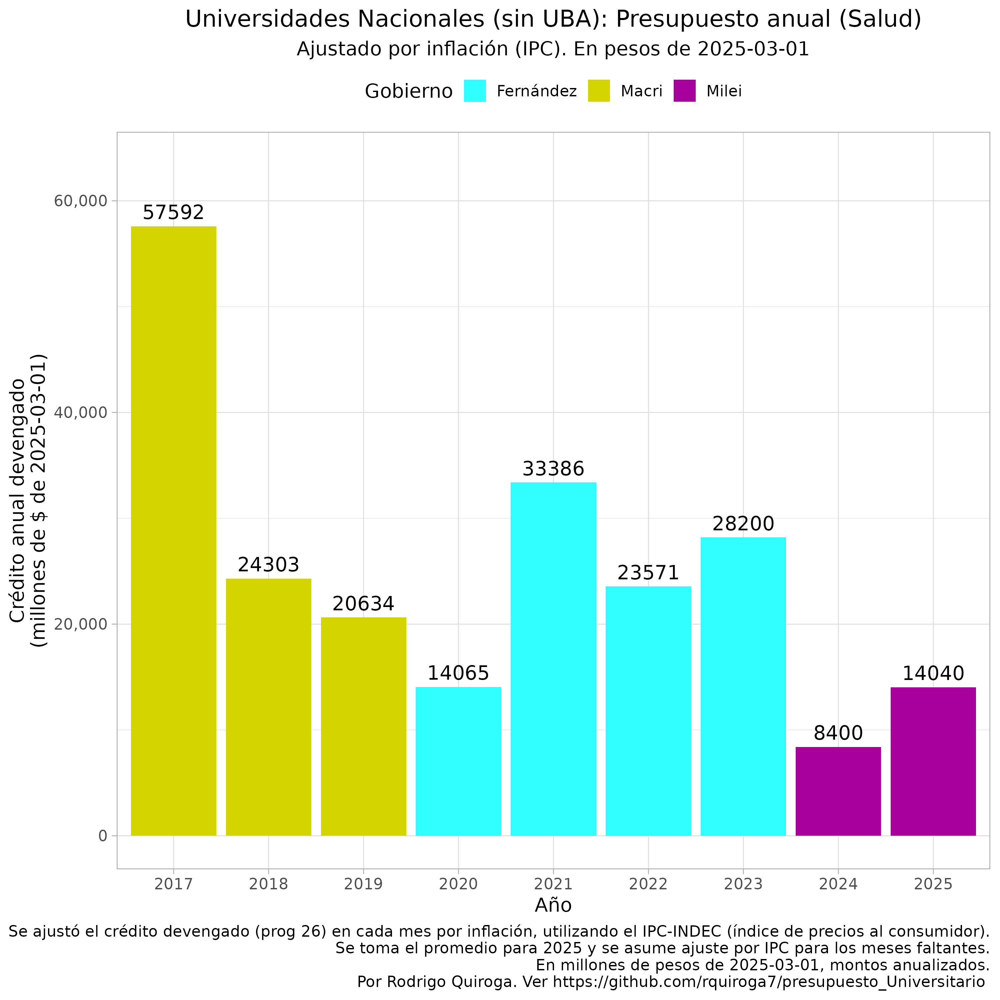

# Universidades Nacionales públicas de Argentina: 
## Análisis de ejecución presupuestaria 2024 y presupuesto 2025
===============================================================

Última actualización 11/04/2025

**Dr. Rodrigo Quiroga**  
Investigador Adjunto INFIQC-CONICET  
Profesor Adjunto de Bioinformática y Biología Computacional y Matemáticas I
Departamento de Química Teórica y Computacional, Facultad de Ciencias Químicas, Universidad Nacional de Córdoba

Repositorio público con todo el código utilizado para descargar, analizar y graficar los datos de ejecución presupuestaria de Universidades Nacionales disponible [aquí](https://github.com/rquiroga7/presupuesto_Universitario).  Este informe se visualiza mejor en un navegador, [aquí](https://github.com/rquiroga7/presupuesto_Universitario). Para descargar este informe en versión PDF, click [aquí](https://github.com/rquiroga7/presupuesto_Universitario/raw/main/2025_04_Presupuesto_Univ.pdf?raw=1).

## Crisis Presupuestaria 2023-2025: Momentos Clave

Podemos analizar la evolución presupuestaria mensual durante los últimos años, que estuvo marcada por 5 momentos clave:

1. **Diciembre 2023**: Asume Javier Milei
    - Enorme reducción de los salarios y presupuestos reales debido a la devaluación del 52% del peso implementada por el gobierno el 12 de diciembre de 2023.

2. **Abril 2024**: Primera Marcha Universitaria Federal
   - Logró un aumento del presupuesto de funcionamiento del 70%
   - Sin incrementos significativos en otras partidas presupuestarias, incluyendo salarios

3. **Septiembre 2024**: Se sanciona la ley de financiamiento universitario

4. **Octubre 2024**: Veto presidencial de la ley de financiamiento universitario. En respuesta, ocurre la Segunda Marcha Universitaria Federal
   - Luego de la marcha, el gobierno decide un nuevo aumento de gastos de funcionamiento y una recomposición parcial (pequeña) de salarios docentes y no-docentes

5. **Enero 2025**: Nuevo Presupuesto 2025 (re-re-conducción del presupuesto 2023)
   - Caída real del presupuesto universitario total del 29% respecto al promedio 2023 y del 14% respecto al último trimestre de 2024.
   - Retroceso salarial y presupuestario, casi a los mismos niveles de inicio de 2024, previo a las marchas universitarias. Profundización de la crisis presupuestaria universitaria

---

## Análisis de la Ejecución Presupuestaria
Primero analizaremos la evolución de la ejecución presupuestaria en términos mensuales, y luego en términos anuales para poner esos cambios en contexto. Analizaremos los montos devengados (crédito que el gobierno nacional se compromete a pagar), todos los montos están ajustados por IPC para sacar los equivalentes en pesos de marzo de 2023, método por el cual volvemos comparables los montos ejecutados a lo largo de los meses y años.

### 1. Evolución Mensual 2023-2025
A continuación analizaremos la evolución mensual del presupuesto universitario destinado a distintas funciones, para el período 2023-2025.

#### 1a. Presupuesto mensual - Funcionamiento

El gráfico muestra la evolución mensual del presupuesto de funcionamiento en términos reales (ajustado a pesos de marzo de 2025). Los aumentos logrados tras las marchas universitarias (abril y octubre 2024) resultaron insuficientes ante la inflación y el aumento de costos operativos. Adicionalmente, la entrada en vigencia del presupuesto 2025 (en realidad de la re-re-conducción del presupuesto 2022) significó un retroceso importante en las partidas para funcionamiento, casi a los niveles previos a la primer marcha universitaria de 2024.

 #### 1b. Presupuesto mensual - Salarios

El presupuesto salarial es diferente. La primer marcha no tuvo como respuesta del gobierno una mejora salarial, lo que sí ocurrió con la segunda marcha. Sin embargo esta mejora fue muy menor, y básicamente consistió en la actualización de la garantía salarial para los docentes de menor antiguedad y dedicación. A partir de las paritarias de 0%-1% de fines de 2024 y 2025, los salarios se volvieron a deteriorar, al punto de ser similares a los niveles previos a la primer marcha universitaria de 2024.

---

### 2. Evolución Presupuestaria Anual 2017-2025

Para poner en contexto los presupuestos universitarios de 2024 y 2025, es importante analizar la evolución anual, al menos desde 2017 en adelante. Para poder comparar 2025 con años anteriores, tomo los datos mensuales promedios para 2025, y realizo una proyección hasta fin de año, teniendo en cuenta aguinaldos, y suponiendo que el presupuesto universitario se aumentará mensualmente de acuerdo al IPC. Es decir, este es un escenario bastante optimista con el cual proyecto la ejecución presupuestaria para 2025. 

#### 2a. Presupuesto Total Anual

El presupuesto total anual muestra una caída muy significativa para el año 2018, una relativa estabilidad presupuestaria hasta 2022, un pequeño aumento en 2023, y una nueva caída dramática para 2024 y 2025.

Si tomamos los datos del número de estudiantes universitarios de los anuarios estadísticos de la SPU, y normalizamos el presupuesto por la cantidad de estudiantes, tomando 2017 como la base 100, vemos que por cada 100 pesos por estudiante que se recibían en 2017, en 2025 las universidades recibirán 33 pesos. De esta manera, es imposible sostener la calidad académica de nuestras universidades públicas. 

#### 2b. Presupuesto de funcionamiento

El presupuesto de funcionamiento muestra una caída histórica:
- 2024: Debido a las recomposiciones logradas en las dos marchas universitarias, el presupuesto anual terminó siendo parecido al de 2023
- 2025: La caída del presupuesto de funcionamiento es muy significativa para los 3 primeros meses del año en comparación a 2024. Proyectado hasta fin de año, representa una caída del 35%. 

#### 2c. Presupuesto de Ciencia y Tecnología

La investigación universitaria enfrenta su peor crisis histórica:
- En 2025 tendremos una caída del presupuesto universitario para ciencia y tecnología del 52% respecto a 2024, del 87% respecto a 2023, y del 95% respecto a 2017.

#### 2d. Presupuesto de extensión

El presupuesto que proviene del gobierno nacional para hacer extensión universitaria (una de las tres funciones sustantivas de las universidades públicas junto a la docencia y la investigación) se redujo a cero durante 2024 y lo mismo sucedió en los primeros tres meses de 2025. Una aberración.

#### 2e. Presupuesto para Salud Universitaria

El sistema hospitalario universitario también está en crisis:
- Mientras que la UBA consiguió un acuerdo especial, que recompuso el financiamiento de su red hospitalaria (aumento del 74% para 2025 contra 2023), los demás hospitales universitarios vieron destruído el presupuesto que reciben del gobierno nacional, con una caída del 50% en 2025 respecto a 2023. 

---

## Conclusiones

La crisis presupuestaria universitaria en el gobierno de Milei representa un punto de inflexión histórico, y de no haber una recomposición presupuestaria este año, los resultados serían catastróficos:

1. **Caída generalizada del presupuesto 2025 en comparación al promedio 2023**
   - Funcionamiento: -35% real
   - Salarios: -26% real
   - Ciencia: -87% real
   - Salud (excluyendo a la UBA): -50% real

2. **Impacto en funciones esenciales y riesgo institucional**
   - Universidades en virtual cesación de pagos dado que la mayoría de los ahorros que existían fueron consumidos durante 2024.
   - Discontinuidad de líneas de investigación y extensión.
   - Pérdida de recursos humanos calificados. Los docentes universitarios están eligiendo otros rumbos, ya sea en el exterior, o en el sector privado. [Los docentes que están al frente de los trabajos prácticos, con poca antiguedad, están cobrando alrededor de 165 mil pesos de bolsillo](https://x.com/rquiroga777/status/1900925151975534592?t=kG0QyZaoTPUmaWuHCQ00GQ).

Queda claro que las marchas universitarias federales fueron la única manera en la cual se logró que el gobierno recompusiera al menos parcialmente los presupuestos de funcionamiento. Sin embargo, los salarios, así como los presupuestos de ciencia, extensión y salud, nunca se recompusieron. Adicionalmente, en los primeros meses de 2025 hubo un claro retroceso respecto de las mejoras presupuestarias conseguidas en 2024. Esto nos sumerge en una crisis presupuestaria y salarial similar a la que teníamos antes de la primer marcha universitaria del 2024.

Esto ha impactado de manera directa en las universidades, con la suspensión de líneas de investigación y proyectos de extensión comunitaria. Adicionalmente, en muchas carreras se suspenden o reducen la cantidad, variedad y complejidad de las actividades prácticas debido a la restricción presupuestaria, resultando en una menor calidad académica. La excelencia y el prestigio académico que las universidades públicas argentinas siempre tuvieron está en franco declive, y vamos rumbo al colapso.

[Las paritarias de estatales que se firmaron en abril de 2025](https://www.laplata1.com/2025-04-11/los-estatales-nacionales-tendran-aumentos-salariales-del-13-y-un-bono-por-unica-vez-de-45-mil-pesos-113683/) implican aumentos mensuales cercanos al 1%, [con expectativas de inflación para marzo cercanas al 3%](https://www.pagina12.com.ar/816900-se-disparo-la-inflacion-en-caba-en-marzo-fue-del-3-2), lo cual demuestra una decisión del gobierno argentino de que en 2025 se profundice aún más la crisis salarial. Esto inevitablemente conlleva un vaciamiento de la planta de trabajadores universitarios, donde los primeros en escapar van a ser aquellos que fácilmente consigan posiciones en universidades y empresas privadas, pero también en el exterior. Este proceso ya inició, y hay múltiples ejemplos en nuestra propia facultad, la Facultad de Ciencias Químicas de la UNC. Debería ser obvio, pero sin docentes de calidad ni salarios dignos, es imposible sostener la excelencia académica de las universidades nacionales argentinas. Sin un cambio urgente, que el último apague la luz!

A nivel personal, opino que la ley de financiamiento universitario no representaba una panacea, pero sí al menos una posibilidad de frenar la destrucción lenta pero sistemática e inevitable a la que nos arroja la crisis presupuestaria.

Dado que presidente Milei vetó dicha ley, dejando claro que el sistema universitario argentino le importa poco y nada, entiendo que la única manera de poder salvarlo de la destrucción lenta y segura, es que se elabore en la cámara de diputados un nuevo proyecto de ley de recomposición salarial y presupuestaria para las universidades, y que [dicho proyecto se someta a una consulta popular vinculante](https://www.pagina12.com.ar/781879-universidades-nacionales-impulsan-una-consulta-popular-para-) (ver [artículo 40 de la constitución](https://www.congreso.gob.ar/constitucionParte1Cap2.php)). Esta consulta popular debería aprobarse por mayoría simple en ambas cámaras, y de resultar positiva, el proyecto se convertiría automáticamente en ley, sin posibilidades de que sea vetada por el presidente Milei. Creo que la comunidad universitaria se debe un debate amplio y urgente sobre esta posibilidad, casi como única escapatoria posible.

Repito a modo de conclusión, que el declive de la calidad académica que ya estamos viendo en nuestras universidades es extremadamente alarmante, y junto a la parálisis de las actividades científicas y extensionistas, marcan un rumbo de franco declive para las universidades públicas argentinas. Nuestro sistema de educación superior era, hasta hace unos años, motivo de orgullo a nivel mundial y una de nuestras ventajas estratégicas relativas de cara al resto del mundo. Deberíamos retomar de manera urgente una agenda pública que nos permita evitar su destrucción inminente, por el bien futuro de nuestros jóvenes y de la sociedad argentina en general. Invito a cada lector de este documento a involucrarse personalmente y sumarse a coordinar una defensa del sistema universitario argentino, y a no esperar que las soluciones las piensen e instrumenten los demás. No hay soluciones individuales para los problemas colectivos!

---

## Metodología

Para quien quiera entrar en detalles metodológicos, expandir para leer la sección de introducción y metodología

 
Ante la decisión del gobierno de Javier Milei de no enviar una ley de presupuesto para 2024, se recondujo el presupuesto 2023 ([Decreto 23/2024](https://www.boletinoficial.gob.ar/detalleAviso/primera/301615/20240105)). Debido a la alta inflación que se observa en el país desde principios de 2023, con un gran salto a fines del 2023 relacionado a la decisión de devaluar el peso un 55% el 12 de diciembre (el precio del dólar oficial saltó un 118%, de 367 a 800 pesos, ver [aquí](https://elpais.com/argentina/2023-12-12/milei-anuncia-una-devaluacion-del-peso-del-50-y-grandes-recortes-del-gasto-publico.html)), el presupuesto 2024 (con montos similares a los de 2023) es obviamente insuficiente para mantener funcionando a las distintas dependencias estatales. En particular esto aplica también para las Universidades Nacionales. Aquí es necesario aclarar que el presupuesto para salarios se está actualizando con cada paritaria, mientras que otros presupuestos como los de funcionamiento, hospitales, extensión, becas e investigación se vieron prácticamente congelados desde noviembre de 2023 hasta febrero de 2024. En 2025, el gobierno de Milei decidió no enviar un proyecto de presupuesto al congreso, sino re-reconducir el presupuesto 2023 , ([Decreto 1131/2024](https://www.argentina.gob.ar/normativa/nacional/decreto-1131-2024-407815)) luego modificado por el ([Decreto 186/2025](https://www.boletinoficial.gob.ar/detalleAviso/primera/322410/20250313)).

El presupuesto indica los montos que el gobierno planifica dedicar a cada ministerio, secretaría, programa y actvidad. Sin embargo, esos montos son simplemente indicativos. Los fondos finalmente devengados y pagados pueden ser mayores o menores (sobreejecución y subejecución). 

El Ministerio de Economía mantiene una base de datos llamada [Presupuesto Abierto](https://www.presupuestoabierto.gob.ar/sici/) de donde pueden descargarse los datos de ejecución presupuestaria. Utilizando dichos datos, analizamos la ejecución presupuestaria mensual y anual, no de los montos pagados, sino de los montos devengados. Para leer una explicación sobre qué significan estos términos, consultar este [glosario](https://www.presupuestoabierto.gob.ar/sici/glosario-e). Esto nos va a permitir saber cuanto dinero se está enviando a las universidades, más allá de cuánto se haya prometido.

Vamos a analizar el crédito devengado bajo el programa 26 (DESARROLLO DE LA EDUCACIÓN SUPERIOR) del ex Ministerio de Educación y actual Ministerio de Capital Humano. Dentro de este programa, se encuentran distintas actividades que podemos resumir en la siguiente lista:
- #actividad_id==1 - Conduccion, Gestion y Apoyo a las Politicas de Educacion Superior
- #actividad_id==11 Fundar
- #actividad_id==12 Salarios Docentes
- #actividad_id==13 Salarios No-Docentes
- #actividad_id==14 Asistencia Financiera para el Funcionamiento Universitario
- #actividad_id==15 Salud (Hospitales Universitarios)
- #actividad_id==16 CyT
- #actividad_id==23 Desarrollo de Institutos Tecnologicos de Formacion Profesional
- #actividad_id==24 Promoción de carreras estratégicas
- #actividad_id==25 Extensión Universitaria

En general vamos a enfocarnos en el presupuesto total (programa 26), o en particular en el presupuesto de funcionamiento, es decir, la actividad 14 (Asistencia Financiera para el Funcionamiento Universitario).

Como metodología, en general vamos a mostrar gráficos de ejecución presupuestaria (crédito devengado) en pesos reales, es decir ajustado por inflación. Esto permite una comparación más realista de los presupuestos de cada mes, dado que los montos se ajustan por IPC para estimar cómo permite afrontar los costos que ese presupuesto está destinado a afrontar. Adicionalmente, cabe aclarar que los montos en pesos se expresarán en millones de pesos equivalentes a los del último mes analizado. Por lo tanto, los montos devengados coinciden para el último mes con los datos que uno puede encontrar en la página de presupuesto abierto, pero para meses anteriores, no habrá coincidencias dado que la página muestra montos nominales. También cabe la aclaración de que el IPC no es el instrumento ideal para deflactar el presupuesto universitario dado que no está diseñado para medir los costos de una universidad, pero es un indicador útil y de alta frecuencia de publicación que bastará para este análisis.

El código de bash y R utilizado para descargar, analizar y graficar los datos de ejecución presupuestaria de 2017-2024 están disponibles abiertamente en este repositorio. Los datos se descargan de la API de Presupuesto abierto (aunque no es necesario que el usuario los descargue ya que están disponibles en este repositorio). El script API_datos.R analiza y genera los gráficos de ejecución presupuestaria mensual, y los scripts UNC_2015-2024.R y 2015_2024.R generan los gráficos anuales, para la UNC y para la totalidad de las Universidades Nacionales, respectivamente. 

