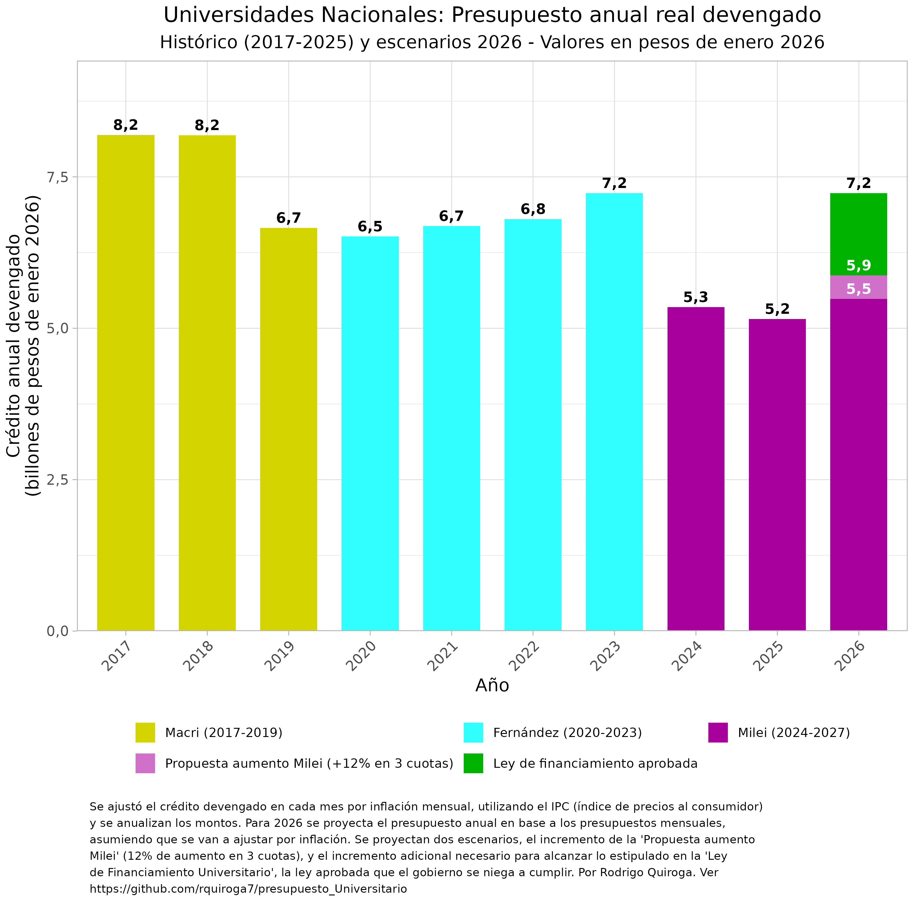

# Crisis presupuestaria y salarial en las Universidades públicas de Argentina: 
## Escenarios presupuestarios 2026: la propuesta del gobierno vs. la Ley de Financiamiento Universitario
===============================================================

Última actualización 13/02/2026

**Dr. Rodrigo Quiroga**  
Investigador Adjunto INFIQC-CONICET  
Profesor Adjunto de Bioinformática y Biología Computacional y Matemáticas I
Departamento de Química Teórica y Computacional, Facultad de Ciencias Químicas, Universidad Nacional de Córdoba

Repositorio público con todo el código utilizado para descargar, analizar y graficar los datos de ejecución presupuestaria de Universidades Nacionales disponible [aquí](https://github.com/rquiroga7/presupuesto_Universitario).  Este informe se visualiza mejor en un navegador, [aquí](https://github.com/rquiroga7/presupuesto_Universitario). Para descargar la versión más actualizada de este informe en versión PDF, click [aquí](https://github.com/rquiroga7/presupuesto_Universitario/raw/main/2026_02_Presupuesto_Univ.pdf?raw=1).

## Crisis Presupuestaria 2023-2026: Momentos Clave

Podemos analizar la evolución presupuestaria mensual durante los últimos años, que estuvo marcada por 6 momentos clave:

1. **Diciembre 2023**: Asume Javier Milei
    - Enorme reducción de los salarios y presupuestos reales debido a la devaluación del 52% del peso implementada por el gobierno el 12 de diciembre de 2023.

2. **Abril 2024**: Primera Marcha Universitaria Federal
   - Logró un aumento del presupuesto de funcionamiento del 70%
   - Sin incrementos significativos en otras partidas presupuestarias, incluyendo salarios

3. **Septiembre 2024**: Se sanciona la ley de financiamiento universitario

4. **Octubre 2024**: Veto presidencial de la ley de financiamiento universitario. En respuesta, ocurre la Segunda Marcha Universitaria Federal
   - Luego de la marcha, el gobierno decide un nuevo aumento de gastos de funcionamiento y una recomposición parcial (pequeña) de salarios docentes y no-docentes

5. **Enero 2025**: Nuevo Presupuesto 2025 (re-re-conducción del presupuesto 2023)
   - Caída real del presupuesto universitario total del 29% respecto al promedio 2023 y del 14% respecto al último trimestre de 2024.
   - Retroceso salarial y presupuestario, casi a los mismos niveles de inicio de 2024, previo a las marchas universitarias.

6. **2026**: Propuesta de aumento del gobierno vs. Ley de Financiamiento Universitario
   - El gobierno se niega a cumplir La Ley de Financiamiento Universitario aprobada, que exige recuperar los niveles presupuestarios reales de 2023
   - El gobierno propone un aumento del 12%, en tres cuotas, recuperando lo perdido en 2025, pero no lo perdido en 2024 
---

## Proyecciones Presupuestarias 2026

### Escenarios comparados: Propuesta del Gobierno vs. Ley de Financiamiento

El gráfico muestra la evolución histórica del presupuesto universitario (2017-2025) junto con tres escenarios para 2026:

- **Presupuesto base 2026 (violeta oscuro)**: Proyección anual del presupuesto de enero de 2026 (~5,5 billones)
- **Propuesta aumento Milei (violeta claro)**: Se suman tres aumentos acumulativos del 4% en marzo, junio y septiembre, que llevan el total a ~5,9 billones
- **Ley de financiamiento Universitario (verde)**: El incremento que estipula la ley que el gobierno se niega a cumplir implica un aumento adicional necesario para alcanzar el nivel real de 2023 (~7,2 billones)

**La brecha entre la propuesta del gobierno y lo que estipula la ley es de aproximadamente 1,3 billones de pesos.**

---

## Análisis de la Ejecución Presupuestaria Histórica
Primero analizaremos la evolución de la ejecución presupuestaria en términos mensuales, y luego en términos anuales para poner esos cambios en contexto. Analizaremos los montos devengados (crédito que el gobierno nacional se compromete a pagar), todos los montos están ajustados por IPC para sacar los equivalentes en pesos de marzo de 2023, método por el cual volvemos comparables los montos ejecutados a lo largo de los meses y años.

### 1. Evolución Mensual 2023-2025
A continuación analizaremos la evolución mensual del presupuesto universitario destinado a distintas funciones, para el período 2023-2025.

#### 1a. Presupuesto mensual - Funcionamiento

El gráfico muestra la evolución mensual del presupuesto de funcionamiento en términos reales (ajustado a pesos de marzo de 2025). Los aumentos logrados tras las marchas universitarias (abril y octubre 2024) resultaron insuficientes ante la inflación y el aumento de costos operativos. Adicionalmente, la entrada en vigencia del presupuesto 2025 (en realidad de la re-re-conducción del presupuesto 2022) significó un retroceso importante en las partidas para funcionamiento, casi a los niveles previos a la primera marcha universitaria de 2024.

 #### 1b. Presupuesto mensual - Salarios

El presupuesto salarial es diferente. La primera marcha no tuvo como respuesta del gobierno una mejora salarial, lo que sí ocurrió con la segunda marcha. Sin embargo esta mejora fue muy menor, y básicamente consistió en la actualización de la garantía salarial para los docentes de menor antiguedad y dedicación. A partir de las paritarias de 0%-1% de fines de 2024 y 2025, los salarios se volvieron a deteriorar, al punto de ser similares a los niveles previos a la primera marcha universitaria de 2024.

---

### 2. Evolución Presupuestaria Anual 2017-2025

Para poner en contexto los presupuestos universitarios de 2024 y 2025, es importante analizar la evolución anual, al menos desde 2017 en adelante.

#### 2a. Presupuesto Total Anual

El presupuesto total anual muestra una caída muy significativa para el año 2018, una relativa estabilidad presupuestaria hasta 2022, un pequeño aumento en 2023, y una nueva caída dramática para 2024 y 2025.

Si tomamos los datos del número de estudiantes universitarios de los anuarios estadísticos de la SPU, y normalizamos el presupuesto por la cantidad de estudiantes, tomando 2017 como la base 100, vemos que por cada 100 pesos por estudiante que se recibían en 2017, en 2025 las universidades recibirán 33 pesos. De esta manera, es imposible sostener la calidad académica de nuestras universidades públicas. 

#### 2b. Presupuesto de funcionamiento

El presupuesto de funcionamiento muestra una caída histórica:
- 2024: Debido a las recomposiciones logradas en las dos marchas universitarias, el presupuesto anual terminó siendo parecido al de 2023
- 2025: La caída del presupuesto de funcionamiento es muy significativa para los 3 primeros meses del año en comparación a 2024. Proyectado hasta fin de año, representa una caída del 35%. 

#### 2c. Presupuesto de Ciencia y Tecnología

La investigación universitaria enfrenta su peor crisis histórica:
- En 2025 tendremos una caída del presupuesto universitario para ciencia y tecnología del 52% respecto a 2024, del 87% respecto a 2023, y del 95% respecto a 2017.

#### 2d. Presupuesto de extensión

El presupuesto que proviene del gobierno nacional para hacer extensión universitaria (una de las tres funciones sustantivas de las universidades públicas junto a la docencia y la investigación) se redujo a cero durante 2024 y lo mismo sucedió en los primeros tres meses de 2025. Una aberración.

#### 2e. Presupuesto para Salud Universitaria

El sistema hospitalario universitario también está en crisis:
- Mientras que la UBA consiguió un acuerdo especial, que recompuso el financiamiento de su red hospitalaria (aumento del 74% para 2025 contra 2023), los demás hospitales universitarios vieron destruído el presupuesto que reciben del gobierno nacional, con una caída del 50% en 2025 respecto a 2023. Es decir, se transfirieron recursos de los hospitales universitarios de todo el país hacia los que pertenecen a la UBA. 

---

## Conclusiones

La crisis presupuestaria universitaria en el gobierno de Milei representa un punto de inflexión histórico:

1. **La propuesta del gobierno para 2026 es insuficiente**
   - Tres aumentos del 4% apenas compensan parcialmente la inflación
   - El presupuesto total (~5,9 billones) queda muy por debajo de los niveles de 2023 (~7,2 billones), e incluso muy por debajo del presupuesto de la pandemia (~6,5 billones)
   - La brecha entre la propuesta del gobierno y la Ley de Financiamiento es de ~1,3 billones de pesos, cuando el gobierno de Milei recortó aproximadamente 2 billones del presupuesto universitario.

2. **Impacto acumulado 2024-2026**
   - Funcionamiento: -35% real respecto a 2023
   - Salarios: -26% real
   - Ciencia: -87% real
   - Salud (excluyendo a la UBA): -50% real

3. **Riesgo institucional**
   - Universidades en virtual cesación de pagos
   - Discontinuidad de líneas de investigación y extensión
   - Pérdida de recursos humanos calificados

Queda claro que la única manera de recomponer el presupuesto universitario al nivel que estipula la ley es mediante una acción política que obligue al gobierno a cumplir con la Ley de Financiamiento Universitario que fue aprobada y posteriormente vetada.

---

## Metodología

Para quien quiera entrar en detalles metodológicos, expandir para leer la sección de introducción y metodología

 
Ante la decisión del gobierno de Javier Milei de no enviar una ley de presupuesto para 2024, se recondujo el presupuesto 2023 ([Decreto 23/2024](https://www.boletinoficial.gob.ar/detalleAviso/primera/301615/20240105)). Debido a la alta inflación que se observa en el país desde principios de 2023, con un gran salto a fines del 2023 relacionado a la decisión de devaluar el peso un 55% el 12 de diciembre (el precio del dólar oficial saltó un 118%, de 367 a 800 pesos, ver [aquí](https://elpais.com/argentina/2023-12-12/milei-anuncia-una-devaluacion-del-peso-del-50-y-grandes-recortes-del-gasto-publico.html)), el presupuesto 2024 (con montos similares a los de 2023) es obviamente insuficiente para mantener funcionando a las distintas dependencias estatales. En particular esto aplica también para las Universidades Nacionales. Aquí es necesario aclarar que el presupuesto para salarios se está actualizando con cada paritaria, mientras que otros presupuestos como los de funcionamiento, hospitales, extensión, becas e investigación se vieron prácticamente congelados desde noviembre de 2023 hasta febrero de 2024. En 2025, el gobierno de Milei decidió no enviar un proyecto de presupuesto al congreso, sino re-reconducir el presupuesto 2023 , ([Decreto 1131/2024](https://www.argentina.gob.ar/normativa/nacional/decreto-1131-2024-407815)) luego modificado por el ([Decreto 186/2025](https://www.boletinoficial.gob.ar/detalleAviso/primera/322410/20250313)).

El presupuesto indica los montos que el gobierno planifica dedicar a cada ministerio, secretaría, programa y actvidad. Sin embargo, esos montos son simplemente indicativos. Los fondos finalmente devengados y pagados pueden ser mayores o menores (sobreejecución y subejecución). 

El Ministerio de Economía mantiene una base de datos llamada [Presupuesto Abierto](https://www.presupuestoabierto.gob.ar/sici/) de donde pueden descargarse los datos de ejecución presupuestaria. Utilizando dichos datos, analizamos la ejecución presupuestaria mensual y anual, no de los montos pagados, sino de los montos devengados. Para leer una explicación sobre qué significan estos términos, consultar este [glosario](https://www.presupuestoabierto.gob.ar/sici/glosario-e). Esto nos va a permitir saber cuanto dinero se está enviando a las universidades, más allá de cuánto se haya prometido.

Vamos a analizar el crédito devengado bajo el programa 26 (DESARROLLO DE LA EDUCACIÓN SUPERIOR) del ex Ministerio de Educación y actual Ministerio de Capital Humano. Dentro de este programa, se encuentran distintas actividades que podemos resumir en la siguiente lista:
- #actividad_id==1 - Conduccion, Gestion y Apoyo a las Politicas de Educacion Superior
- #actividad_id==11 Fundar
- #actividad_id==12 Salarios Docentes
- #actividad_id==13 Salarios No-Docentes
- #actividad_id==14 Asistencia Financiera para el Funcionamiento Universitario
- #actividad_id==15 Salud (Hospitales Universitarios)
- #actividad_id==16 CyT
- #actividad_id==23 Desarrollo de Institutos Tecnologicos de Formacion Profesional
- #actividad_id==24 Promoción de carreras estratégicas
- #actividad_id==25 Extensión Universitaria

En general vamos a enfocarnos en el presupuesto total (programa 26), o en particular en el presupuesto de funcionamiento, es decir, la actividad 14 (Asistencia Financiera para el Funcionamiento Universitario).

**Metodología de proyección 2026:** Para proyectar el presupuesto 2026, se utiliza el promedio mensual del presupuesto 2026 como base. Se aplican los multiplicadores correspondientes según cada escenario:
- **Propuesta aumento Milei**: Tres aumentos acumulativos del 4% aplicados en marzo, junio y septiembre (multiplicadores: 1.04, 1.04², 1.04³)
- **Ley de financiamiento**: Presupuesto mensual necesario para igualar el total anual de 2023

Se consideran los meses de junio y diciembre con un factor de 1.45 para contemplar el aguinaldo. Todos los valores se expresan en pesos de enero 2026 utilizando proyecciones de IPC del Relevamiento de Expectativas de Mercado (REM) del BCRA.

Como metodología, la mayoría de los gráficos son de ejecución presupuestaria (crédito devengado) en pesos reales, es decir ajustado por inflación. Esto permite una comparación más realista de los presupuestos de cada mes, dado que los montos se ajustan por IPC para estimar cómo permite afrontar los costos que ese presupuesto está destinado a afrontar. También cabe la aclaración de que el IPC no es el instrumento ideal para deflactar el presupuesto universitario dado que no está diseñado para medir los costos de una universidad, pero es un indicador útil y de alta frecuencia de publicación que bastará para este análisis.

El código de bash y R utilizado para descargar, analizar y graficar los datos de ejecución presupuestaria de 2017-2026 están disponibles abiertamente en este repositorio. Los datos se descargan de la API de Presupuesto abierto (aunque no es necesario que el usuario los descargue ya que están disponibles en este repositorio). El script API_datos.R analiza y genera los gráficos de ejecución presupuestaria mensual, el script proyeccion_2025_2026.R genera las proyecciones y gráficos comparativos para 2026, y los scripts UNC_2015-2024.R y 2015_2024.R generan los gráficos anuales, para la UNC y para la totalidad de las Universidades Nacionales, respectivamente. 

