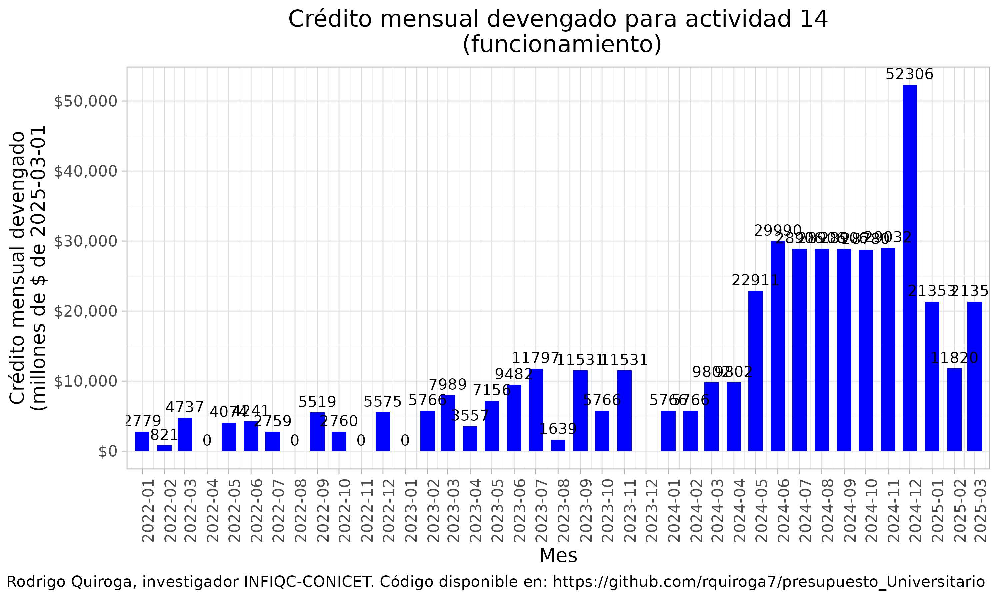
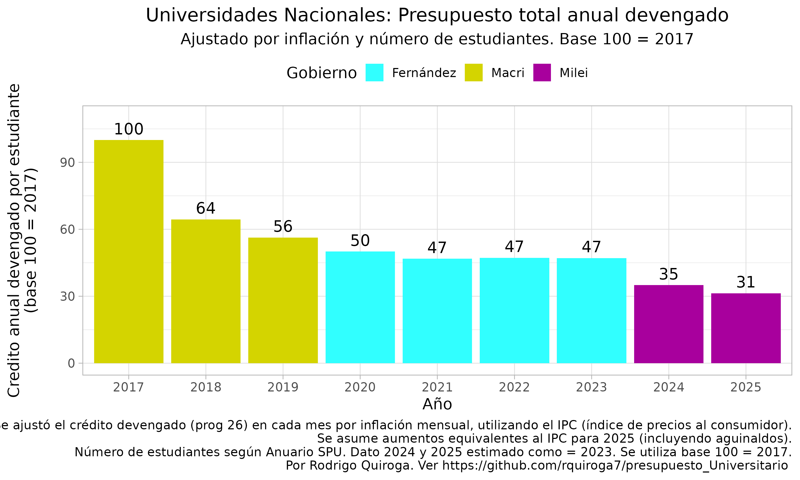

Universidades Nacionales públicas de Argentina: 
Análisis de ejecución presupuestaria 2024 y presupuesto 2025
=================================================================================

Última actualización 09/04/2025

**Dr. Rodrigo Quiroga**  
Investigador Asistente INFIQC-CONICET  
Profesor Adjunto de Bioinformática y Biología Computacional  
Departamento de Química Teórica y Computacional, Facultad de Ciencias Químicas, Universidad Nacional de Córdoba

Repositorio disponible con todo el código utilizado para descargar, analizar y graficar los datos de ejecución presupuestaria de Universidades Nacionales [aquí](https://github.com/rquiroga7/presupuesto_Universitario).

Ejecución presupuestaria mensual 2023-2025
============

La evolución presupuestaria mensual durante 2024-2025 estuvo marcada por tres momentos clave:

1. **Abril 2024**: Primera Marcha Universitaria Federal
   - Logró un aumento del presupuesto de funcionamiento del 70%
   - Sin incrementos significativos en otras partidas presupuestarias

2. **Octubre 2024**: Segunda Marcha Universitaria Federal
   - Nuevo aumento del 50% en gastos de funcionamiento
   - Actualización parcial de salarios docentes y no-docentes

3. **Enero 2025**: Nuevo Presupuesto
   - Caída real del presupuesto total del 37% respecto a 2023
   - Profundización de la crisis presupuestaria universitaria

El gráfico muestra la evolución mensual del presupuesto de funcionamiento en términos nominales. Los aumentos logrados tras las marchas universitarias (abril y octubre 2024) resultaron insuficientes ante la inflación y el aumento de costos operativos.

Ejecución presupuestaria anual 2017-2025
============

Análisis por componente presupuestario:

### Presupuesto de funcionamiento

El presupuesto de funcionamiento muestra una caída histórica:
- 2024: Reducción al 65% respecto a 2023
- 2025: Nueva caída al 55% del presupuesto 2023

### Presupuesto de Ciencia y Tecnología

La investigación universitaria enfrenta su peor crisis:
- Caída al 45% respecto a 2023
- Suspensión de programas de investigación
- Riesgo para la formación de recursos humanos

### Presupuesto de Salud Universitaria

Sistema hospitalario universitario en crisis:
- UBA: Situación crítica para su red hospitalaria
- Otras universidades: Deterioro de servicios de salud estudiantil
- 2025: Presupuesto real menor al 40% de 2023

### Impacto en el Sistema Universitario

El presupuesto total ajustado por inflación muestra una caída sin precedentes:

- 2024: 73% del presupuesto 2023
- 2025: 63% del presupuesto 2023
- Peor nivel histórico desde 2017

La situación es aún más grave al considerar el presupuesto por estudiante:

- 2024: 47% del presupuesto por estudiante de 2017
- 2025: 41% del presupuesto por estudiante de 2017
- Deterioro crítico de condiciones de enseñanza

Conclusiones
============

La crisis presupuestaria universitaria 2024-2025 representa un punto de inflexión histórico:

1. **Caída generalizada del presupuesto**
   - Funcionamiento: -45% real (2023-2025)
   - Ciencia: -55% real (2023-2025)
   - Salud: -60% real (2023-2025)

2. **Impacto en funciones esenciales**
   - Suspensión de programas de investigación
   - Deterioro de servicios hospitalarios
   - Crisis en gastos operativos básicos

3. **Riesgo institucional**
   - Universidades en virtual cesación de pagos
   - Discontinuidad de programas académicos
   - Pérdida de recursos humanos calificados

La defensa de la universidad pública requiere:
- Recomposición presupuestaria urgente
- Actualización por inflación real
- Garantías de financiamiento sostenible

INTRODUCCIÓN Y METODOLOGÍA
============

Para quien quiera entrar en detalles metodológicos, expandir para leer la sección de introducción y metodología

 
Ante la decisión del gobierno de Javier Milei de no enviar una ley de presupuesto para 2024, se recondujo el presupuesto 2023 ([Decreto 23/2024](https://www.boletinoficial.gob.ar/detalleAviso/primera/301615/20240105)). Debido a la alta inflación que se observa en el país desde principios de 2023, con un gran salto a fines del 2023 relacionado a la decisión de devaluar el peso un 55% el 12 de diciembre (el precio del dólar oficial saltó un 118%, de 367 a 800 pesos, ver [aquí](https://elpais.com/argentina/2023-12-12/milei-anuncia-una-devaluacion-del-peso-del-50-y-grandes-recortes-del-gasto-publico.html)), el presupuesto 2024 (con montos similares a los de 2023) es obviamente insuficiente para mantener funcionando a las distintas dependencias estatales. En particular esto aplica también para las Universidades Nacionales. Aquí es necesario aclarar que el presupuesto para salarios se está actualizando con cada paritaria, mientras que otros presupuestos como los de funcionamiento, hospitales, extensión, becas e investigación se vieron prácticamente congelados desde noviembre de 2023 hasta febrero de 2024.

El presupuesto indica los montos que el gobierno planifica dedicar a cada ministerio, secretaría, programa y actvidad. Sin embargo, esos montos son simplemente indicativos. Los fondos finalmente devengados y pagados pueden ser mayores o menores (sobreejecución y subejecución). 

El Ministerio de Economía mantiene una base de datos llamada [Presupuesto Abierto](https://www.presupuestoabierto.gob.ar/sici/) de donde pueden descargarse los datos de ejecución presupuestaria. Utilizando dichos datos, analizamos la ejecución presupuestaria mensual y anual, no de los montos pagados, sino de los montos devengados. Para leer una explicación sobre qué significan estos términos, consultar este [glosario](https://www.presupuestoabierto.gob.ar/sici/glosario-e). Esto nos va a permitir saber cuanto dinero se está enviando a las universidades, más allá de cuánto se haya prometido.

Vamos a analizar el crédito devengado bajo el programa 26 (DESARROLLO DE LA EDUCACIÓN SUPERIOR) del ex Ministerio de Educación y actual Ministerio de Capital Humano. Dentro de este programa, se encuentran distintas actividades que podemos resumir en la siguiente lista:
- #actividad_id==1 - Conduccion, Gestion y Apoyo a las Politicas de Educacion Superior
- #actividad_id==11 Fundar
- #actividad_id==12 Salarios Docentes
- #actividad_id==13 Salarios No-Docentes
- #actividad_id==14 Asistencia Financiera para el Funcionamiento Universitario
- #actividad_id==15 Salud (Hospitales Universitarios)
- #actividad_id==16 CyT
- #actividad_id==23 Desarrollo de Institutos Tecnologicos de Formacion Profesional
- #actividad_id==24 Promoción de carreras estratégicas
- #actividad_id==25 Extensión Universitaria

En general vamos a enfocarnos en el presupuesto total (programa 26), o en particular en el presupuesto de funcionamiento, es decir, la actividad 14 (Asistencia Financiera para el Funcionamiento Universitario).

Como metodología, en general vamos a mostrar gráficos de ejecución presupuestaria (crédito devengado) en pesos reales, es decir ajustado por inflación. Esto permite una comparación más realista de los presupuestos de cada mes, dado que los montos se ajustan por IPC para estimar cómo permite afrontar los costos que ese presupuesto está destinado a afrontar. Adicionalmente, cabe aclarar que los montos en pesos se expresarán en millones de pesos equivalentes a los del último mes analizado. Por lo tanto, los montos devengados coinciden para el último mes con los datos que uno puede encontrar en la página de presupuesto abierto, pero para meses anteriores, no habrá coincidencias dado que la página muestra montos nominales. También cabe la aclaración de que el IPC no es el instrumento ideal para deflactar el presupuesto universitario dado que no está diseñado para medir los costos de una universidad, pero es un indicador útil y de alta frecuencia de publicación que bastará para este análisis.

El código de bash y R utilizado para descargar, analizar y graficar los datos de ejecución presupuestaria de 2017-2024 están disponibles abiertamente en este repositorio. Los datos se descargan de la API de Presupuesto abierto (aunque no es necesario que el usuario los descargue ya que están disponibles en este repositorio). El script API_datos.R analiza y genera los gráficos de ejecución presupuestaria mensual, y los scripts UNC_2015-2024.R y 2015_2024.R generan los gráficos anuales, para la UNC y para la totalidad de las Universidades Nacionales, respectivamente. 

Para descargar este informe en versión PDF, click [aquí](https://github.com/rquiroga7/presupuesto_Universitario/raw/main/informe_pres_univ.pdf?raw=1).
